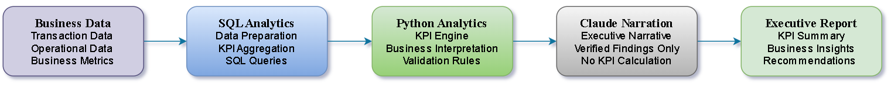
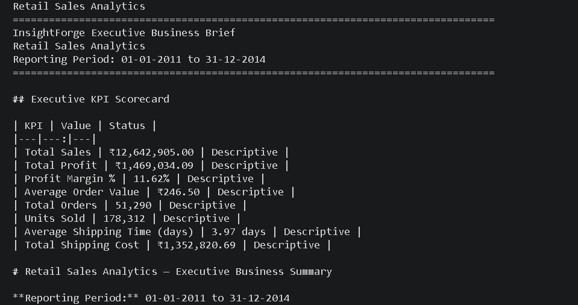
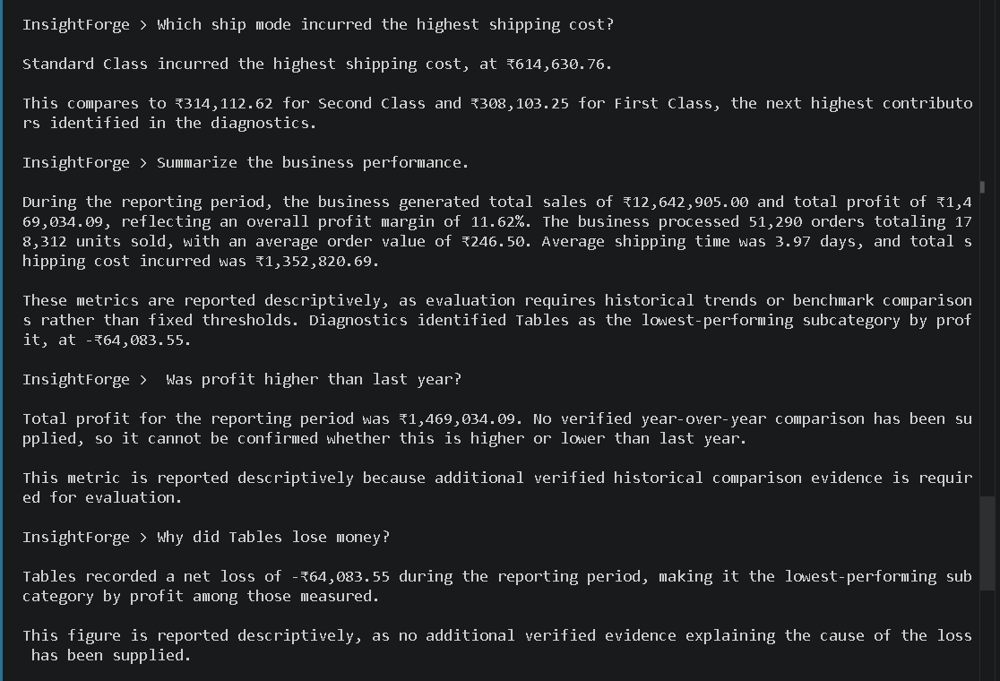
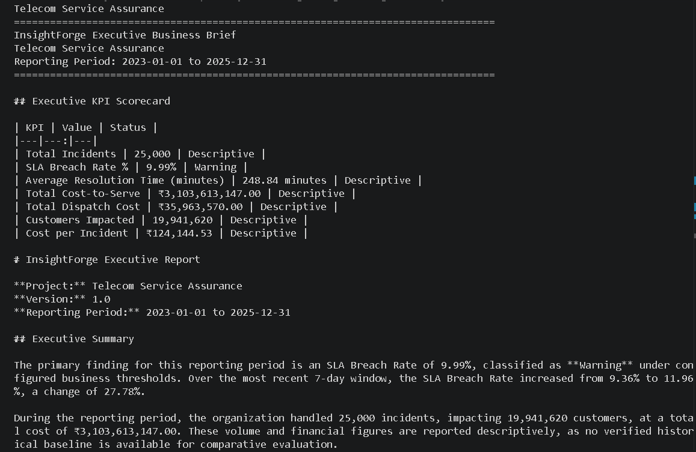
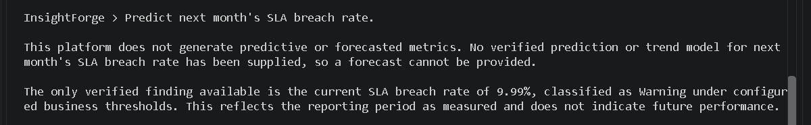

# InsightForge – Executive Analytics Platform


A configuration-driven executive analytics platform that transforms verified business metrics into executive-ready reports and interactive business insights. AI communicates verified analytical findings—it never calculates business metrics.

| Business Domains | Analytics Engine | Reports | Interactive Analyst |
|-----------------:|:----------------:|:-------:|:-------------------:|
| 2 | Configuration Driven | Executive Reports | Natural Language Q&A |

---

## Overview

Executive reporting often requires analysts to translate business metrics into reports for decision-makers. While language models can produce fluent summaries, they should not be responsible for calculating business metrics or drawing analytical conclusions.

InsightForge addresses this by separating analytical computation from executive communication. SQL prepares the analytical data, Python calculates KPIs and business interpretations, and the language model converts verified findings into executive-ready narrative. Every reported metric, comparison, and recommendation is produced before the language model is involved, ensuring reports remain deterministic, explainable, and traceable.

The platform is configuration-driven rather than domain-specific. KPI definitions, thresholds, dimensions, business rules, and interpretation logic are maintained through external YAML configuration, allowing the same analytics engine to support multiple business domains without changing the core application.

The current implementation has been validated across two independent business domains:

- Retail Sales Analytics
- Telecom Service Assurance Analytics

---

## Table of Contents

- [Overview](#overview)
- [Why InsightForge?](#why-insightforge)
- [Key Features](#key-features)
- [How It Works](#how-it-works)
- [System Architecture](#system-architecture)
- [Project Preview](#project-preview)
- [Supported Business Domains](#supported-business-domains)
- [Technology Stack](#technology-stack)
- [Project Highlights](#project-highlights)
- [Repository Structure](#repository-structure)
- [Getting Started](#getting-started)
- [Documentation](#documentation)
- [Contact](#contact)
- [License](#license)

---

## Why InsightForge?

InsightForge was built around one principle: **analytics should be completed before narrative begins.**

- Deterministic KPI calculation using SQL and Python
- Rule-based business interpretation
- AI limited to communicating verified findings
- Explainable reporting with complete analytical traceability
- Multi-domain support through configuration

---

## Project Highlights

- Validated across two independent business domains using the same analytics engine and application workflow.
- Configuration-driven architecture enables new business domains without modifying the core application.
- Deterministic KPI calculation and business interpretation performed before AI-generated narration.
- Executive reports and interactive analyst mode use the same verified analytical results.
- Clear separation between data processing, business logic, and executive communication to improve consistency, traceability, and maintainability.
  

---
## Key Features

- Configuration-driven analytics engine
- Deterministic KPI calculation
- Business interpretation layer
- Threshold-based KPI classification
- Period-over-period comparison
- Executive report generation
- Interactive analyst mode
- Multi-domain support
- Explainable reporting

---

## How It Works

InsightForge follows a deterministic analytics workflow in which every business insight is verified before narrative generation begins.

1. **Load Configuration**  
   The application loads the selected business domain, including KPI definitions, thresholds, dimensions, and business rules from a YAML configuration.

2. **Retrieve Business Data**  
   SQL queries retrieve and aggregate data from the configured MySQL database.

3. **Generate Business Metrics**  
   Python calculates KPIs, applies business interpretation rules, performs comparisons where configured, and identifies the most significant business findings.

4. **Generate Executive Narrative**  
   The language model converts verified analytical findings into clear executive language without performing calculations or modifying analytical results.

5. **Support Interactive Analysis**  
   The same verified analytical results are used to answer business questions through the interactive analyst mode.

---
## System Architecture

SQL performs data aggregation, Python calculates KPIs and business interpretations, and the language model communicates verified findings without altering their meaning.



InsightForge follows a deterministic analytics pipeline where every KPI is calculated and validated before any AI-generated narrative is produced.

---

## Project Preview

The screenshots below demonstrate the same analytics framework operating across two independent business domains. Executive reports and interactive analysis are generated from the same verified analytical results, ensuring consistent answers regardless of how information is requested.

### Retail Sales Analytics

| Executive Report |
  
| Interactive Analyst |
  

*Executive reporting and interactive business analysis for retail sales performance.*

---

### Telecom Service Assurance Analytics

| Executive Report |
  
| Interactive Analyst |
  

 *Executive reporting and interactive operational analysis for telecom service assurance.*

---

## Supported Business Domains

| Domain | Status | Purpose |
|---------|:------:|---------|
| Retail Sales Analytics | ✅ | Sales performance and profitability analysis |
| Telecom Service Assurance Analytics | ✅ | Incident, SLA and cost-to-serve analysis |
| Additional Business Domains | 🔄 | Supported through configuration |

---

## Technology Stack

| Category | Technologies | Purpose |
|----------|--------------|---------|
| Programming | Python | Analytics engine, business interpretation, report generation |
| Database | MySQL | Data storage and analytical queries |
| Query Layer | SQL | Data aggregation and KPI calculation |
| Data Processing | Pandas | Data manipulation and transformation |
| ORM | SQLAlchemy | Database connectivity |
| AI | Claude API | Executive narrative generation |
| Configuration | YAML | Domain-specific configuration |
| Reporting | python-docx, ReportLab | Executive report generation |

---

## Repository Structure

```text
InsightForge
│
├── agent/
├── assets/
│   └── screenshots/
├── config/
├── database/
├── docs/
├── engine/
├── samples/
├── tests/
├── main.py
├── requirements.txt
└── README.md
```

---

## Getting Started

```bash
git clone https://github.com/ankitattri05/InsightForge.git

cd InsightForge

pip install -r requirements.txt

python main.py
```

Configure your database connection and Claude API credentials before running the application.

---

## Documentation

Supporting project documentation is available in the `docs` directory.

- Business Requirements Document (BRD)
- System Architecture
- Data Dictionary
- Project Documentation
  
---

## Contact

**Ankit Attri**

- GitHub: https://github.com/ankitattri05
- LinkedIn: www.linkedin.com/in/ankit-attri3396
- Email: ankitattri05@gmail.com

---

## License

This project is licensed under the MIT License.
