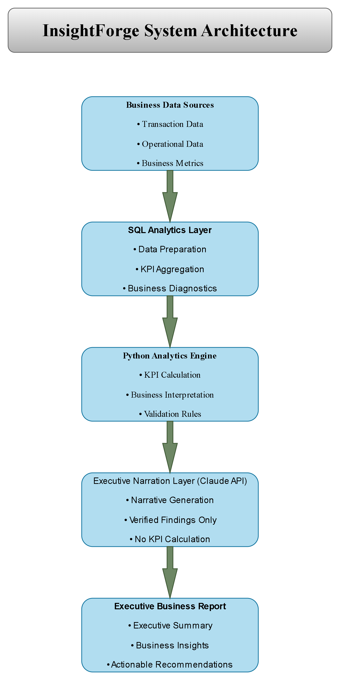

# InsightForge – Executive Analytics Platform

A configuration-driven analytics platform that converts verified business metrics into executive-ready reports while ensuring that every insight is backed by deterministic analytics rather than AI-generated reasoning.

<p align="center">
  
</p>

---

## Overview

InsightForge separates analytical computation from executive communication. SQL and Python calculate every KPI, comparison, and business interpretation before any information reaches the language model. The language model is responsible only for converting verified findings into clear business narrative.

The platform is configuration-driven, allowing the same analytics engine to support different business domains through external YAML configuration rather than changes to the core application. The current implementation has been validated across two independent domains: **Retail Sales Analytics** and **Telecom Service Assurance Analytics**.

The result is a reporting framework that is deterministic, explainable, and easier to extend without compromising analytical integrity.

---

## Why InsightForge?

- Deterministic analytics before AI-generated narrative.
- Every reported value is traceable to SQL or Python computation.
- Business interpretation follows predefined rules rather than AI inference.
- The same engine supports multiple business domains through configuration.
- The language model cannot calculate KPIs, infer trends, or generate unsupported conclusions.

---

## Key Features

- Configuration-driven analytics using YAML.
- Deterministic KPI calculation with SQL and Python.
- Rule-based business interpretation.
- Threshold-based KPI classification.
- Period-over-period comparison where configured.
- Executive report generation from verified findings.
- Interactive analyst mode for business questions.
- Multi-domain support without changing the core engine.
- Explainable reporting with a clear audit trail.

---

## System Architecture

InsightForge follows a layered architecture where each component has a single responsibility. SQL performs data aggregation, the analytics engine calculates KPIs and business interpretations, and the language model communicates only verified findings. This separation ensures that analytical results remain deterministic while narrative generation stays strictly evidence-based.

<p align="center">
  
</p>

---

## Supported Business Domains

| Domain | Status | Description |
|--------|:------:|-------------|
| Retail Sales Analytics | ✅ Implemented | Sales performance, profitability, customer behaviour, and operational reporting. |
| Telecom Service Assurance Analytics | ✅ Implemented | Service assurance, SLA performance, incident analytics, cost-to-serve, and operational diagnostics. |
| Additional Business Domains | 🔄 Supported | New domains can be added through configuration without modifying the core analytics engine. |

---

## Technology Stack

| Category | Technologies |
|----------|--------------|
| Programming | Python 3 |
| Database | MySQL |
| Query Layer | SQL |
| ORM | SQLAlchemy |
| Data Processing | Pandas |
| AI | Claude API |
| Configuration | YAML |
| Report Generation | python-docx, ReportLab |

---

## Project Highlights

- One analytics engine validated across two independent business domains.
- Configuration-driven design with no core code changes required for new domains.
- Deterministic KPI calculation and business interpretation before AI narration.
- Evidence-based reporting that prevents unsupported metrics, trends, and conclusions.
- Separation of analytics, business logic, and executive communication into independent layers.
- Interactive analyst mode and executive report generation built on the same verified analytical results.

---

## Future Enhancements

- Support additional business domains through configuration.
- Expand the library of deterministic KPIs and business diagnostics.
- Add broader period-over-period comparison capabilities.
- Integrate interactive dashboards alongside report generation.
- Continue extending business interpretation rules while preserving deterministic analytics.

---

## Repository Structure

```text
InsightForge/
│
├── agent/          # Executive narration and report generation
├── config/         # Domain configurations (YAML)
├── docs/           # BRD, architecture and documentation
├── engine/         # KPI engine and business interpretation
├── sql/            # Database schema and analytical queries
├── reports/        # Generated executive reports
├── main.py         # Application entry point
├── requirements.txt
└── README.md
```

---

## Getting Started

### Prerequisites

- Python 3.x
- MySQL
- Claude API Key

### Installation

```bash
git clone https://github.com/your-username/InsightForge.git

cd InsightForge

pip install -r requirements.txt
```

### Configuration

1. Create a `.env` file and add your database and Claude API credentials.
2. Select the required domain configuration from the `config/` directory.
3. Ensure the corresponding MySQL database is available.

### Run

```bash
python main.py
```

---

## Documentation

Project documentation is available in the **docs/** directory.

- Business Requirements Document (BRD)
- System Architecture
- Project Documentation

---

## Contact

**Ankit Attri**

- LinkedIn: *Add Profile Link*
- GitHub: https://github.com/ankitattri05
- Email: *Add Email Address*

---

## License

This project is licensed under the MIT License. See the `LICENSE` file for details.

---

## Acknowledgements

InsightForge was developed as a portfolio project to demonstrate practical business analytics, deterministic reporting, and AI-assisted executive communication using SQL, Python, and modern analytics engineering practices.