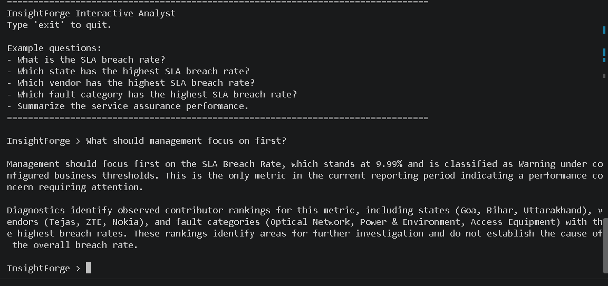

# InsightForge – Executive Analytics Platform


A configuration-driven analytics platform that transforms verified business metrics into executive-ready reports while keeping analytical computation and AI-generated communication strictly separate.

---

## Overview

InsightForge separates analytical computation from executive communication. SQL prepares analytical data, Python calculates KPIs and business interpretations, and the language model converts verified findings into executive-ready narrative. Every reported metric is produced before the language model is involved, ensuring reports remain deterministic, explainable, and traceable.

The platform is configuration-driven, allowing the same analytics engine to support multiple business domains through external YAML configuration. The current implementation has been validated across Retail Sales Analytics and Telecom Service Assurance Analytics.

---

## Why InsightForge?

InsightForge was built around one principle: **analytics should be completed before narrative begins.**

- Deterministic KPI calculation using SQL and Python
- Rule-based business interpretation
- AI limited to communicating verified findings
- Explainable reporting with complete analytical traceability
- Multi-domain support through configuration

---

## Key Features

- Configuration-driven analytics engine
- Deterministic KPI calculation
- Business interpretation layer
- Threshold-based KPI classification
- Period-over-period comparison
- Executive report generation
- Interactive analyst mode
- Multi-domain support
- Explainable reporting

---

## System Architecture

SQL performs data aggregation, Python calculates KPIs and business interpretations, and the language model communicates verified findings without altering their meaning.


---

## Project Preview

### Retail Sales Analytics

| Executive Report |
|  |
| Interactive Analyst |
|  |

---

### Telecom Service Assurance Analytics

| Executive Report |
|  |
| Interactive Analyst |
|  |

---

## Supported Business Domains

| Domain | Status | Purpose |
|---------|:------:|---------|
| Retail Sales Analytics | ✅ | Sales performance and profitability analysis |
| Telecom Service Assurance Analytics | ✅ | Incident, SLA and cost-to-serve analysis |
| Additional Business Domains | 🔄 | Supported through configuration |

---

## Technology Stack

| Category | Technologies |
|----------|--------------|
| Programming | Python |
| Database | MySQL |
| Analytics | SQL, Pandas |
| ORM | SQLAlchemy |
| AI | Claude API |
| Configuration | YAML |
| Reporting | python-docx, ReportLab |

---

## Project Highlights

- One analytics engine validated across two independent business domains.
- Configuration-driven architecture requiring no core code changes.
- Business interpretation completed before AI narration.
- Deterministic, evidence-based reporting.
- Clear separation between analytics, business logic, and executive communication.

---

## Repository Structure

```text
InsightForge
│
├── agent/
├── assets/
│   └── screenshots/
├── config/
├── database/
├── docs/
├── engine/
├── samples/
├── tests/
├── main.py
├── requirements.txt
└── README.md
```

---

## Getting Started

```bash
git clone https://github.com/ankitattri05/InsightForge.git

cd InsightForge

pip install -r requirements.txt

python main.py
```

Configure your database connection and Claude API credentials before running the application.

---

## Documentation

Detailed documentation is available in the `docs` directory.

- Business Requirements Document
- Architecture Overview
- Data Dictionary
- Project Structure

---

## Contact

**Ankit Attri**

- GitHub: https://github.com/ankitattri05
- LinkedIn: *(Add your LinkedIn profile)*
- Email: *(Add your email address)*

---

## License

This project is licensed under the MIT License.
